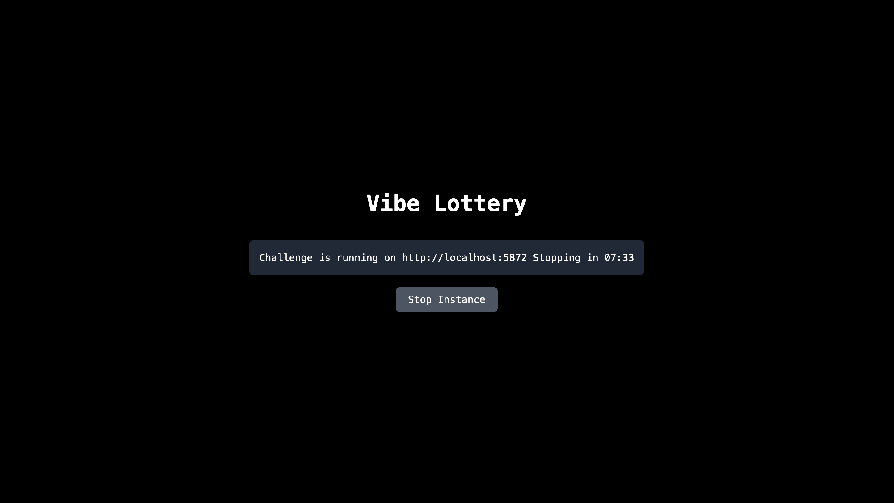

# CTF Instance Runner



A simple web application for managing temporary isolated CTF challenge instances using Docker containers.

## Quick Start with Docker Hub

### 1. Project Structure

Create your project directory like this:

```
my-ctf-challenge/
├── docker-compose.yml          # Main runner config
├── .env                        # Environment variables
├── start.sh                    # Setup script (optional)
└── chall/                      # Your challenge files
    ├── docker-compose.yml      # Challenge Docker config
    ├── start.sh                # Start script
    ├── stop.sh                 # Stop script
    ├── Dockerfile              # Your challenge image
    └── app.py                  # Your challenge code
```

### 2. Download Template Files

Create these files in your project directory:

**start.sh**

```bash
#!/bin/bash

# Make chall scripts executable
chmod +x chall/start.sh chall/stop.sh

# Start the runner
docker-compose up --build -d
```

**docker-compose.yml**

```yaml
services:
    ctf-instance-runner:
        image: boedegoat/ctf-instance-runner:latest
        ports:
            - "${RUNNER_PORT}:80"
        environment:
            - FLASK_ENV=production
            - DOMAIN=${DOMAIN}
            - DURATION=${DURATION}
            - CHALL_PORT_RANGE_START=${CHALL_PORT_RANGE_START}
            - CHALL_PORT_RANGE_END=${CHALL_PORT_RANGE_END}
            - RUNNER_PORT=${RUNNER_PORT}
            - CHALL_TITLE=${CHALL_TITLE}
        volumes:
            - /tmp:/tmp
            - ./chall:/app/chall
            - /var/run/docker.sock:/var/run/docker.sock
        restart: unless-stopped
```

**.env**

```bash
DOMAIN=http://localhost
DURATION=900000
CHALL_PORT_RANGE_START=10000
CHALL_PORT_RANGE_END=110000
RUNNER_PORT=5000
CHALL_TITLE=My CTF Challenge
```

### 3. Add Your Challenge

Create a `chall/` directory with these template files:

**chall/docker-compose.yml**

```yaml
services:
    web:
        build: .
        ports:
            - "${PORT}:80" # adjust the internal port based on your app
```

**chall/start.sh**

```bash
#!/bin/bash

# $1 = port
# $2 = instance name
docker_compose_path="$(pwd)/chall/docker-compose.yml"
PORT=$1 docker-compose -f "${docker_compose_path}" -p $2 up --build -d
```

**chall/stop.sh**

```bash
#!/bin/bash

docker_compose_path="$(pwd)/chall/docker-compose.yml"
PORT=$1 docker-compose -f "${docker_compose_path}" -p $2 down
```

Then add your challenge files:

-   `Dockerfile` - Your challenge's Docker image
-   `app.py` (or any files) - Your challenge application

### 4. Run

Run the runner start script:

```bash
./start.sh
```

This script will:

-   Make challenge scripts executable
-   Start the CTF runner with Docker Compose

Alternatively, run manually:

```bash
# Make scripts executable
chmod +x chall/start.sh chall/stop.sh

# Start the runner
docker-compose up -d
```

Access your CTF runner at `http://localhost:5000` (or your configured RUNNER_PORT).

## Environment Variables

-   `DOMAIN` - Base domain/IP for challenge URLs (e.g., http://localhost, https://ctf.example.com)
-   `DURATION` - Instance lifetime in milliseconds (900000 = 15 minutes)
-   `CHALL_PORT_RANGE_START/END` - Port range for challenge instances (avoid conflicts with system ports)
-   `RUNNER_PORT` - Port for the web interface (where users access the runner)
-   `CHALL_TITLE` - Display name for your challenge (shown in the web interface)

## Important Notes

-   The `${PORT}` variable in `chall/docker-compose.yml` is automatically set by the runner
-   Scripts receive port and instance_id as arguments: `start.sh <port> <instance_id>`
-   Make sure your challenge exposes the correct port (typically 80 inside the container)
